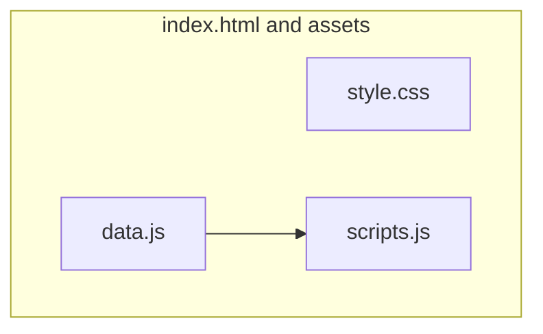
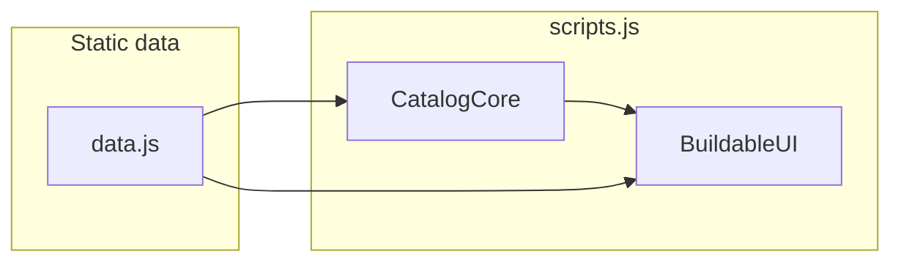
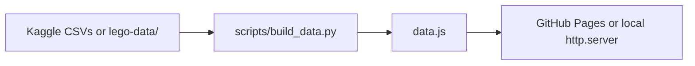

# Buildable

**Live site:** [https://angelina-chen.github.io/buildable/](https://angelina-chen.github.io/buildable/)

LEGO catalog mini-app: filter and sort a static subset of sets, track a **parts I have** list, and see **% match** per set against that list.

## Table of contents

- [Overview](#overview)
- [Features](#features)
- [Architecture](#architecture)
- [Tech stack](#tech-stack)
- [Repository layout](#repository-layout)
- [Quick start](#quick-start)
- [Data pipeline](#data-pipeline)
- [Images and hosting](#images-and-hosting)
- [GitHub Pages](#github-pages)
- [Credits](#credits)

## Overview

Buildable is a **static single-page** experience: all catalog facts live in **`data.js`** (loaded with `<script src="data.js">` — this counts as **data imported from a file**, not variables at the top of `scripts.js`, and satisfies the Stage 2 note to avoid **fetching a catalog API** at runtime). **`scripts.js`** defines **`CatalogCore`** (pure set/part math, no DOM), **`BuildableUI`** (DOM, events, rendering), and a **`DOMContentLoaded`** bootstrap that calls **`BuildableUI.init()`** once `parts` and `sets` exist.

There is **no backend** and **no `fetch`** for catalog JSON at runtime.

## Features

- **Filters:** LEGO theme, era bucket, sort order (name, year, piece count, % match).
- **Set search:** name or set number (trimmed, case-insensitive).
- **Parts I have:** search catalog parts, add chips; drives each card's **% match** and detail "still need" list.
- **Catalog grid:** empty state, set cards with progress and wishlist control; **scroll-window rendering** when many sets match (only visible cards stay in the DOM).
- **Theme:** light / dark toggle; choice is saved in **`localStorage`** under `buildable-theme`, with a tiny inline script in **`index.html`** so the first paint matches saved preference.
- **Wishlist drawer:** in-memory until reload; mark owned on rows.
- **Set detail modal:** stats and missing parts vs your list.
- **Custom set form:** append a user-defined set into the in-memory catalog for the session.

## Architecture

### Runtime (browser)



Inside **`scripts.js`** (top to bottom): **`CatalogCore`** IIFE (set/part math only, no DOM) → **`BuildableUI`** IIFE (DOM, listeners, virtual catalog when the filtered list is large) → a small **`DOMContentLoaded`** block that checks `parts` / `sets` and calls **`BuildableUI.init()`**.

### Data vs UI separation



## Tech stack

| Layer | Choice |
|--------|--------|
| Markup / chrome | HTML5 |
| Styling | CSS3 (custom properties, grid/flex) |
| App logic | ES5-style JS (IIFEs, no bundler) |
| Data | Generated `data.js` (`const parts`, `const sets`) |
| Data build (local) | Python 3 + pandas (+ optional kagglehub) |

## Repository layout

```text
.
├── .github/workflows/      # GitHub Pages deploy (static bundle)
├── index.html              # Shell, templates, script order
├── style.css               # All layout and theme
├── data.js                 # Generated catalog (commit for Pages)
├── scripts.js              # CatalogCore, BuildableUI, DOMContentLoaded bootstrap
├── assets/                 # favicon, placeholder art
├── images/sets/            # optional local box thumbnails (same filenames as set ids)
└── scripts/
    └── build_data.py       # CSVs -> data.js
```

## Quick start

### 1. Preview the site locally

From the repo root:

```bash
python3 -m http.server 8080
```

Open `http://localhost:8080`. Using `http://` avoids `file://` quirks for scripts and assets. If **`data.js`** is missing, the page shows a short message: run **`python3 scripts/build_data.py`** from the repo root, then refresh.

Use another port: `python3 -m http.server 9000`.

### 2. (Re)build `data.js` from CSVs

Install Python deps once:

```bash
pip install "pandas>=2.0" "kagglehub>=0.2"
```

Then:

```bash
python3 scripts/build_data.py -o data.js
```

**Defaults (maximum slice):** `build_data.py` defaults are **`--max-sets 0`**, **`--per-theme 0`**, **`--top-parts 0`** — i.e. no final set cap, every set per theme in the pick list, and **every distinct part** in the merged inventory (not only the old “top N by set count” subset). That keeps the Kaggle export as complete as this pipeline allows. The script prints a **stderr warning** when any of those is unbounded; expect **long builds**, a **large `data.js`**, and slower **first load / parse** in the browser.

**Smaller deploy (e.g. GitHub Pages):** cap explicitly, for example:

```bash
python3 scripts/build_data.py --max-sets 600 --per-theme 40 --top-parts 800 -o data.js
```

The script prefers `./lego-data/` or `$LEGO_DATA_DIR` with `sets.csv` present; otherwise it can use the [kagglehub](https://github.com/Kaggle/kagglehub) cache for [rtatman/lego-database](https://www.kaggle.com/datasets/rtatman/lego-database).

## Data pipeline



Tables used in the generator align with the class dataset: `sets`, `themes`, inventories (version 1), `inventory_parts`, `parts`, `part_categories`. Each set’s `parts` array lists **unique part ids** from the merged inventory (CSV **quantity** is not expanded); **`sets.num_parts`** stays the CSV’s official count.

**Large catalogs in the browser:** `scripts.js` keeps the full filtered list in memory but, when more than about **48** sets match, mounts only the cards in the **scroll viewport** (fixed row height + absolute positioning; row height must stay aligned with **`--catalog-card-height`** in `style.css`). **Match `%` on each card** is computed when that card is built, except when you sort by **“% match”** — then every matching set needs a `%` up front so the global order is correct. Changing filters still runs `filterSets` over the full in-memory catalog produced from `data.js`. **Resize** (window, layout column, catalog viewport, `visualViewport`) triggers a debounced reflow of the virtual grid so column counts stay correct on narrow screens.

## Images and hosting

- **Local:** you can commit thumbnails under `images/sets/` named like the set id (e.g. `7740-1.jpg`, `.webp`, or `.png`) for reliable static hosting.
- **Remote:** `data.js` carries CDN URLs; the UI tries additional fallbacks and **`assets/placeholder-set.svg`** so broken images do not leave an empty frame.

## Credits

Snap Engineering Academy **Stage 2** static-page pattern, extended with catalog logic in **`CatalogCore`** and the interactive UI in **`BuildableUI`** (`scripts.js`).
